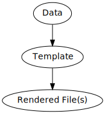
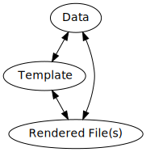

# Goals


* Allow users to use logic for writing prose without leaving
the sentence they are writing.

* Provide intuitive build support for various output formats.


## The Problem With Template Languages

> Allow users to use logic for writing prose without leaving
the sentence they are writing.

A common architecture for writing documents that contain dynamic data is 
shown below:




Data is used to fill in place holders specified by a template. The filled-in
template is then used to produce some document(s). For example, 

1.
  ```
  Markdown + YAML -> HTML Template -> Static Website
  ```
  Markdown and YAML are fed into an HTML template to produce a static website. 

1.
  ```
  JSON -> LaTeX Template -> PDF
  ```
  JSON and a LaTeX template are used to produce a PDF document.

There are a few problems with this workflow:

* _Content switching_: Context switching is an enemy of writing and template systems are a losing
battle for the author.  Re-usable text must be stored in a separate file
(like JSON) and the consuming template is in another. Authors are forced to
learn 3 languages to write: a template language, a markup language, and a
data language.

* Template languages do not support higher order logic and data languages
typically don't support even first order logic. If an author needs these
features then they need to bring in a 4th language the spits out at least
the data structure consumed by the template language.

* IO is not supported at all by templating languages. Writing documentation
that enforces valid sample code is a matter of error-prone copy and paste by
the author - instead of executing at least a type checker on the sample
program. Why write something like:

> The "`add7 (3)`" function produces produces "`4`"

by hand? Automating this process makes bad code and typos fail the build
process.  Essentially, documentation can fail.

## Conix And The Union of Data and Templates

Again, here's the data pipeline for templating languages:


Conix solves the above problems by allowing the user to have complete 
intermingling of the data, templates, and filesystem output.




Here's an example[^2]. Say I'm writing down how many fried chicken and waffles[^1]
that I need:

[^1]: This is vital documentation to keep programmes healthy.
[^2]: Btw. This document is dogfooding conix to produce this example. I didn't manually write 
the example you are seeing here.

  ```markdown

# of guests: 9
Fried Chickens: 3
Buttermilk Biscuits: 18
  ``` 

Notice the logic involved to produce the correct text:

  * The amount of food depends on the number of guests. In this case there are
9\ people.
  * 1 chicken feeds 3\ people.
  * 1 person eats 2\ waffles.

But if were to just write the above in a markdown file I'd have to compute
those numbers by hand...bleh! I'm a programmer...I'm lazy. I'd like the
computer to do the computing for me. Here's the same snippet written in conix
and the output auto-generated by conix:

```nix
texts [
'' 
# of guests: ''(label "guestCount" 9)''

Fried Chickens: ''(t (conix.sample.guestCount / 3))''

Buttermilk Biscuits: ''(t (conix.sample.guestCount * 2))
]


```
```

# of guests: 9
Fried Chickens: 3
Buttermilk Biscuits: 18
```


Conix allows the user to label different pieces of their content as NixValues and then later
reference that data to create new content. This makes a separate data layer unnecessary.

## Conix Is Output Agnostic

> Provide intuitive build support for various output formats.

Markdown is amazing. However, building documents from multiple files is
difficult and often requires a bash script build system. Conix builds on the
solution to the first goal to provide a build system that's convenient.
The user describes the file structure of their output and conix takes
care of the rest. Here's an example taken from the project readme:

```nix
}).conix.build (conix: { vol = with conix.lib; using [(markdownFile "Volunteers")] (texts [
```

Here we've stated that the output should be a markdownFile. Conix takes care of
creating that markdown file with the final derivation's text.  However, we
could easily change this so that the output could be an html or pdf instead.
Thus we haven't lost the power of current markup languages like markdown.

